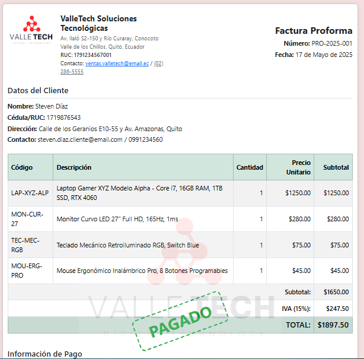

# facturabootstrap

## Repositorio correspondiente a la Actividad #3

##### Tema:

Creación de una Factura/Proforma con Estilo CSS Externo

#### Estudiante:

Steven Javier Díaz Lara

#### Tutor: Ing. Vilmer David Criollo Chanchicocha

#### Nrc:

23357

#### Objetivo:

Desarrollar una interfaz web que represente una factura o proforma utilizando tablas HTML y aplicando estilos CSS desde un archivo externo. El trabajo debe de simular un documento real utilizado para ventas, con datos organizados de manera profesional.

#### Uso

Revisar el archivo **index.html**

#### Deploy

